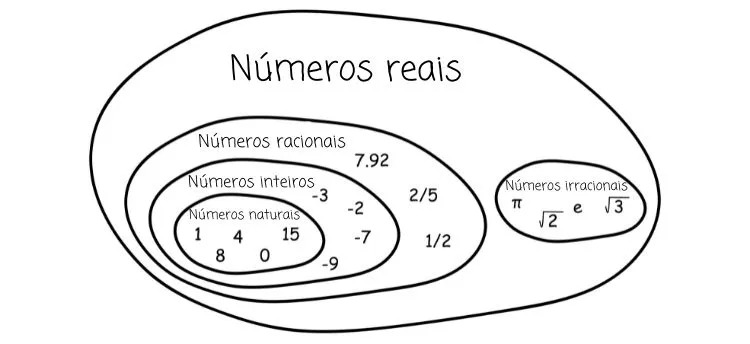

# Resumo do Capítulo 7 - Kata de Frações - do livro Software Craft

Por favor, deixe-me saber se você precisa de mais informações sobre o conteúdo do artigo.

## Divida

Descubra como o trabalho pode ser dividido. Aqui, a divisão é meio evidente: as quatro operações. Cada uma das quatro operações está no mesmo nível de abstração. Se você começar a trabalhar em uma operação, deve manter o foco nela.

## Prioritize

Por complexidade - Comece pela operação que parece mais simples (aqui a adição).
Pergunte ao cliente - Talvez o cliente precise da divisão como prioridade, pergunte a eles.

## Explorar

Vamos supor que desejamos focar na adição.

Agora queremos explorar o problema, discutindo com o cliente para eliminar qualquer mal-entendido e coletar dados para nossos testes:
   -  Exemplos de frações (apenas inteiros, números reais, números imaginários). => numerador e denominador são inteiros (incluindo negativos)
   -  Exemplo de adições (mais complexas possíveis, as mais fáceis possíveis, mais prováveis).
   -  Adição com mais de dois fatores?
   -  Casos especiais ou regras das quais devo estar ciente? => denominadores não nulos, 0 no numerador implica 0 para a fração, se numerador e denominador forem iguais, a fração é 1.
   -  Como você deseja ver o resultado? (simplificado apenas, tanto simplificado quanto bruto, ponto flutuante).
   -  Como simplificar e o que isso significa? => MDC (Máximo Divisor Comum).

Numerador / Denomidador ex: 5/7 onde 5 é o numerador e o 7 é o denomidador

## Regras de Negócio

Agora temos muitas regras de negócio, exemplos e critérios de aceitação para a adição:
   - 0 como uma fração.
   - 1 como uma fração.
   - Números inteiros como frações.
   - Denominadores iguais.
   - Denominadores diferentes.
   - Frações negativas.
   - 0 como um denominador.
   - Simplificação.

Agora, você pode explorar as outras operações ou começar a trabalhar na adição usando a metodologia TDD (Desenvolvimento Orientado a Testes).

  

## TDD (Test-Driven Development)

   - Comece com um teste que falha - O primeiro teste é "Zero mais zero deve retornar zero". Seu teste deve seguir a organização/afirmação/execução, mas deve ser construído na ordem inversa Execução/Afirmação/Organização.
   - Use o código mínimo possível para fazer o teste passar.
   - Realize um commit.

Agora, você pode voltar ao passo um, introduzindo apenas um novo conceito de cada vez.

Você pode precisar criar um segundo teste necessário que falhe para implementar a simplificação usando o MDC (Máximo Divisor Comum) e, para implementá-lo, você pode usar o TDD de forma cega ou encontrar algoritmos existentes ou verificar as capacidades da sua linguagem.

## Refatoração

Usando a linguagem do domínio, você pode definir:
   - Subtração = adição com a fração oposta.
   - Divisão = multiplicação com o inverso da fração.

'Oposta' e 'inverso' podem ser definidos como métodos públicos; assim, o código fica mais legível e utiliza a linguagem do domínio.

Conclusão
Esteja você trabalhando em um kata ou em um projeto real, tente seguir estas diretrizes:
1. Divida o problema no nível de abstração mais elevado possível.
2. Priorize.
3. Explore - mergulhe em um dos subproblemas e repita os passos 1 e 2. Faça muitas perguntas, encontre exemplos, casos especiais, descubra complexidades ocultas e elimine todos os mal-entendidos.
4. Utilize TDD (Desenvolvimento Orientado a Testes) + Refatoração usando lógica especializada do domínio.
5. Certifique-se de anotar todos os pontos de dificuldade que você enfrentou ao implementar a funcionalidade e os problemas com o código. Você pode discutir esses problemas com sua equipe ou pesquisá-los para trabalhar de forma mais eficaz e melhorar sua experiência de codificação."

Essas diretrizes são valiosas para melhorar o processo de desenvolvimento de software e a qualidade do código, seja em katas de treinamento ou em projetos do mundo real.